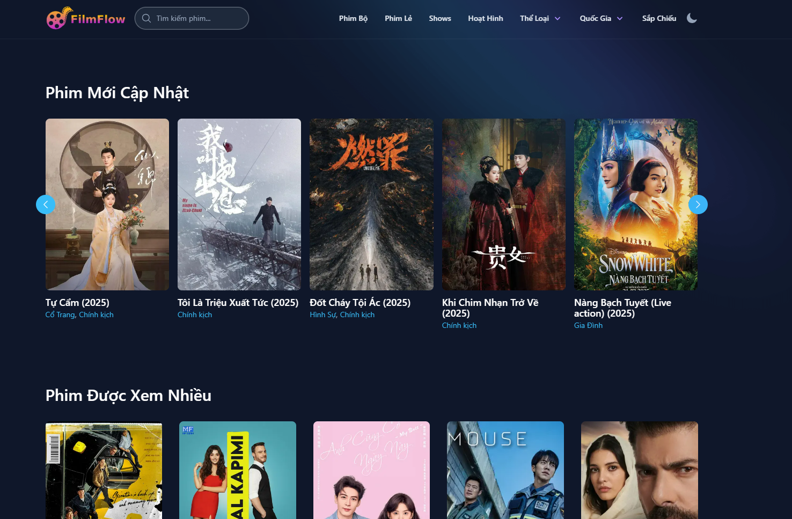

# 🎬 FilmFlow - Trang web khám phá phim

**FilmFlow** là trang web xem phim online miễn phí, chất lượng cao với hàng ngàn bộ phim từ nhiều thể loại khác nhau.

## 🚀 Tính năng nổi bật

- 📌 **Danh sách phim**: Xem danh sách phim mới nhất, phim thịnh hành và được đánh giá cao.
- 🎥 **Xem phim**: Xem phim trực tuyến với chất lượng cao.
- 🔍 **Tìm kiếm thông minh**: Tìm kiếm phim theo tên, thể loại hoặc năm phát hành.
- 🎭 **Chi tiết phim**: Xem thông tin chi tiết về từng bộ phim, bao gồm diễn viên, đạo diễn, thời lượng, v.v.
- 📺 **Trailer & hình ảnh**: Xem trailer và ảnh minh họa của từng bộ phim.

## 📷 Hình ảnh minh họa



## 🛠️ Công nghệ sử dụng

- **Next.js** - Framework React giúp tối ưu hiệu suất
- **TypeScript** - Ngôn ngữ lập trình mạnh mẽ với kiểm tra kiểu tĩnh
- **Tailwind CSS** - Thiết kế giao diện linh hoạt và đẹp mắt

## 📦 Cách cài đặt & chạy dự án

1️⃣ Clone dự án về máy

```bash
git clone https://github.com/duc82/filmflow.git
cd filmflow
```

2️⃣ Cài đặt dependencies

```bash
npm install
```

3️⃣ Chạy dự án

```bash
npm run dev
```

Dự án sẽ chạy tại `http://localhost:3000`

## 🎯 Đóng góp

Nếu bạn muốn đóng góp, vui lòng tạo **Pull Request** hoặc báo lỗi qua **Issues**.

## 📜 Giấy phép

Dự án này được phát hành theo giấy phép [MIT](LICENSE).

💡 _Chúc bạn có trải nghiệm xem phim tuyệt vời với FilmFlow!_ 🎥🍿
